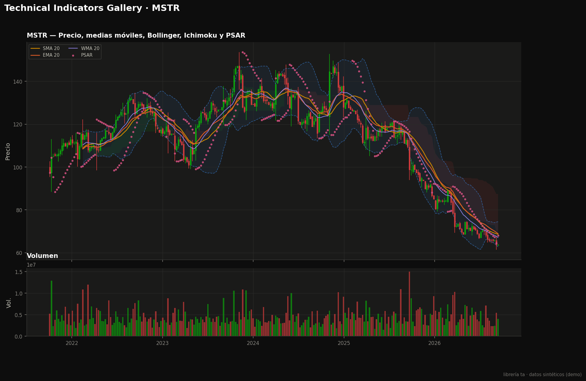
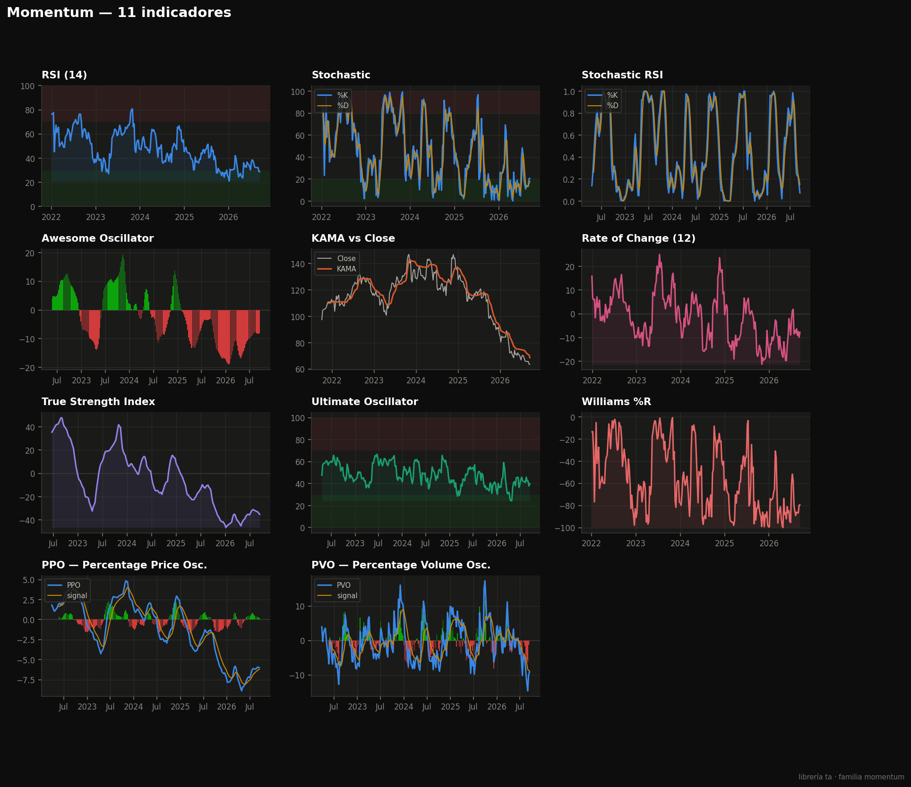
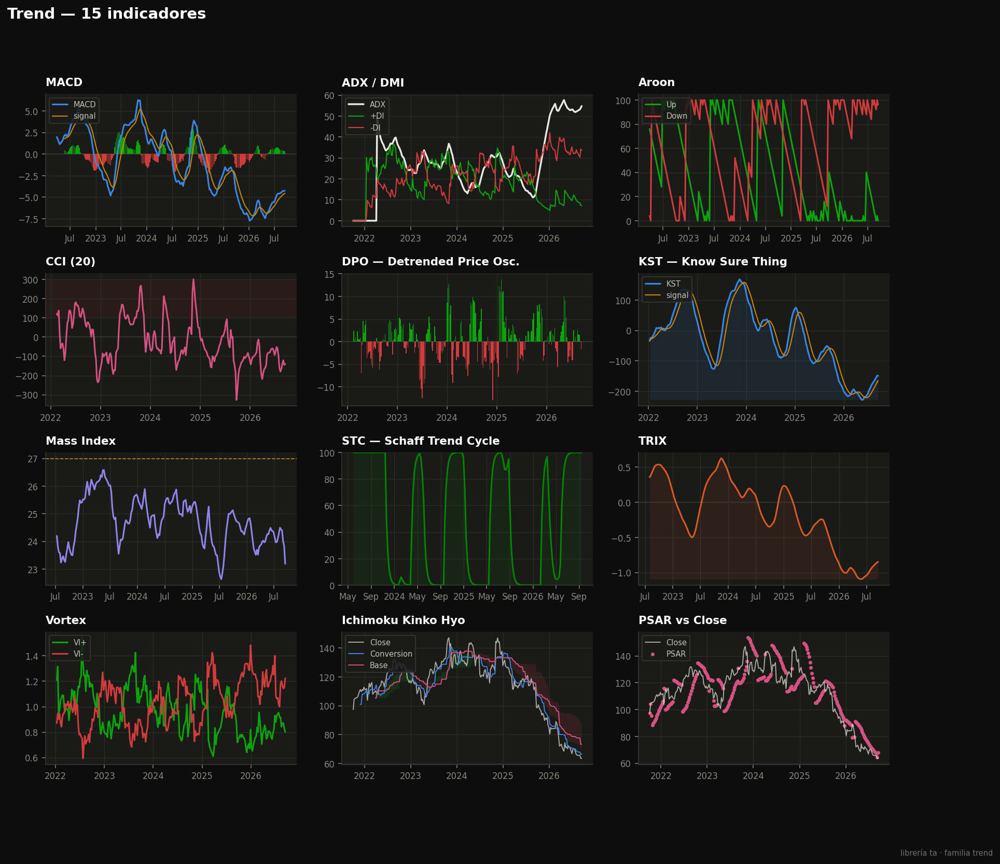
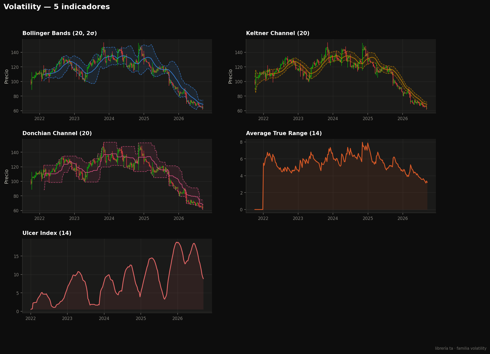
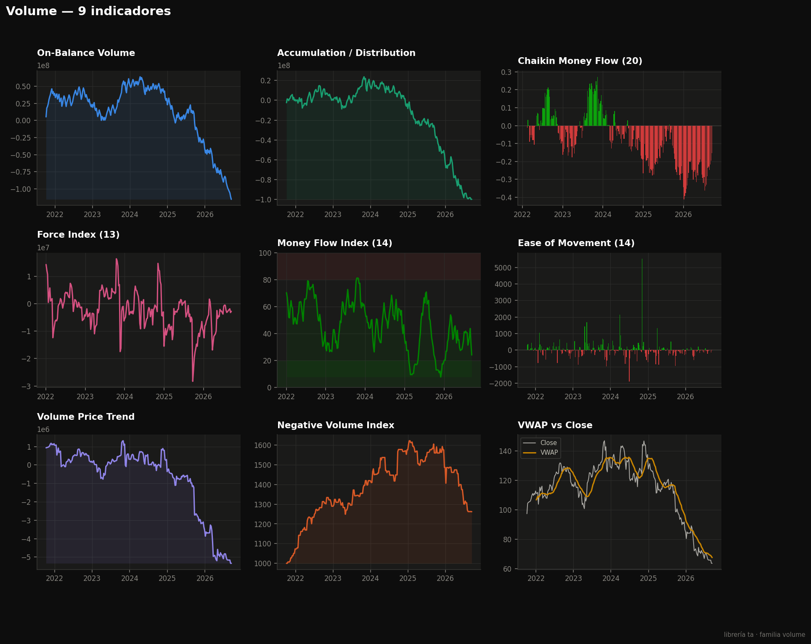

# Technical Indicators Gallery


Un recorrido visual por **todo el catálogo de la librería [`ta`](https://github.com/bukosabino/ta)**: los **40 indicadores técnicos** de las cuatro familias (momentum, trend, volatility, volume) calculados sobre datos reales de mercado y presentados en una **galería con un tema oscuro, colorido y accesible** (paleta *colorblind-safe*).

> 🇬🇧 [English version below](#english)



---

## Qué es

La mayoría de los tutoriales de análisis técnico muestran un RSI y un par de medias móviles. Este proyecto hace lo contrario: **barre la librería `ta` completa**, calcula cada indicador con parámetros sensatos y los dibuja con un sistema visual consistente, pensado para que el catálogo entero se lea de un vistazo.

- **Datos:** [`yfinance`](https://github.com/ranaroussi/yfinance) (Yahoo Finance, sin API key). Si no hay conexión, un generador **sintético** realista permite reproducir la galería igual.
- **Cálculo:** `src/indicators.py` computa los 40 indicadores agrupados por familia.
- **Estilo:** `src/theme.py` define una única paleta y estilo de matplotlib. Todo el resto pinta *por rol* (precio, señal, banda, positivo/negativo), nunca con colores sueltos.
- **Salida:** cinco figuras en `figures/` — un gráfico "hero" de precio y una galería por familia.

## El catálogo (40 indicadores)

| Familia | Indicadores |
|---|---|
| **Momentum** (11) | RSI · Stochastic · Stochastic RSI · Awesome Oscillator · KAMA · ROC · TSI · Ultimate Oscillator · Williams %R · PPO · PVO |
| **Trend** (15) | SMA · EMA · WMA · MACD · ADX/DMI · Aroon · CCI · DPO · Ichimoku · KST · Mass Index · PSAR · STC · TRIX · Vortex |
| **Volatility** (5) | Bollinger Bands · Keltner Channel · Donchian Channel · ATR · Ulcer Index |
| **Volume** (9) | OBV · Acc/Dist · Chaikin Money Flow · Force Index · MFI · Ease of Movement · VPT · NVI · VWAP |

## Galería

### Momentum


### Trend


### Volatility


### Volume


## Decisiones de diseño

- **Paleta validada.** Los ocho tonos categóricos están en un orden fijo elegido para mantener separación de color bajo daltonismo (protanopía/deuteranopía/tritanopía); nunca se ciclan ni se reordenan.
- **Color por trabajo.** Verde/rojo solo para dirección (velas, histogramas divergentes: MACD, Awesome, CMF…); azul para bandas; una sub-rampa azul para rellenos con degradado.
- **Zonas con significado.** Sobrecompra/sobreventa (RSI, Stochastic, MFI, Ultimate) van sombreadas, no como líneas sueltas.
- **Un solo eje por panel.** Nada de dobles ejes-Y; cada indicador vive en su propio panel a su escala.

## Cómo correrlo

Requiere Python 3.10+.

```bash
pip install -r requirements.txt

python src/gallery.py --ticker MSTR --period 5y --interval 1wk
# las figuras quedan en figures/
```

Opciones: `--ticker` (cualquier símbolo de Yahoo Finance), `--period`, `--interval`, y `--no-synthetic` (falla en vez de usar datos sintéticos si no hay red).

## Nota sobre datos y automatización

Las figuras de este repositorio se regeneran **automáticamente cada semana** mediante un workflow de GitHub Actions (`.github/workflows/refresh-gallery.yml`) que corre en la nube (con acceso a internet), descarga datos frescos vía `yfinance` y commitea la galería actualizada. También se puede disparar a mano desde la pestaña **Actions**.

## Stack

`Python` · [`ta`](https://github.com/bukosabino/ta) · `yfinance` · `pandas` · `numpy` · `matplotlib`

## Descargo

Proyecto educativo y de visualización. **No** es asesoría financiera ni una señal de trading.

## Licencia

[MIT](LICENSE)

---

<a name="english"></a>

## Technical Indicators Gallery (English)

A visual sweep through the **entire [`ta`](https://github.com/bukosabino/ta) library**: all **40 technical indicators** across the four families (momentum, trend, volatility, volume), computed on real market data and laid out in a **dark, colorful, colorblind-safe gallery**.

- **Data:** `yfinance` (Yahoo Finance, no API key); a realistic **synthetic** generator provides an offline fallback so the gallery always reproduces.
- **Compute:** `src/indicators.py` builds all 40 indicators grouped by family.
- **Style:** `src/theme.py` is the single source of truth for the palette and matplotlib style — everything paints *by role*, never with loose hex values.
- **Output:** a price "hero" chart plus one gallery figure per family, in `figures/`.

The eight categorical hues use a fixed, CVD-validated order; green/red is reserved for direction (candles and diverging histograms), blue for bands, and a blue ramp for gradient fills. Overbought/oversold zones are shaded, and every indicator lives on its own single-axis panel.

```bash
pip install -r requirements.txt
python src/gallery.py --ticker AAPL --period 5y --interval 1wk
```

The committed figures are refreshed weekly by a GitHub Actions workflow that pulls fresh data with `yfinance` and commits the updated gallery. Educational / visualization project — **not** financial advice.
